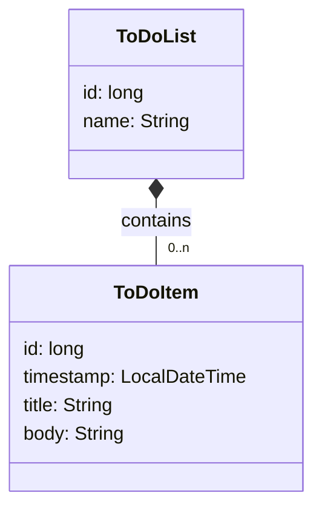
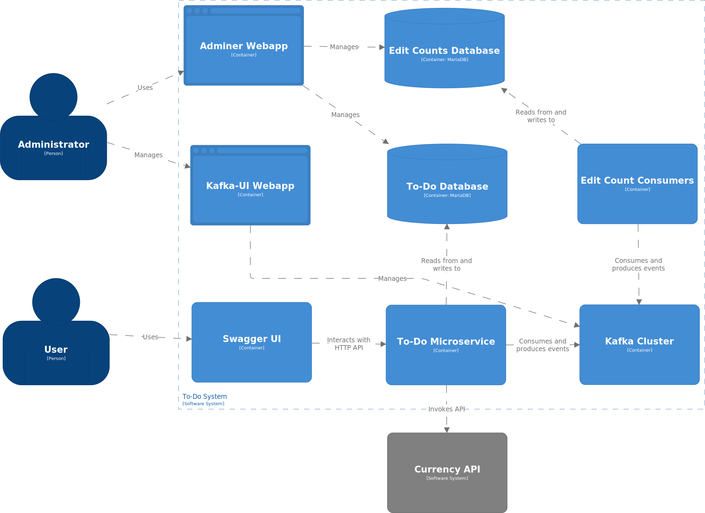

# Example Micronaut microservice

This project contains an example of a small microservice developed with [Micronaut](https://micronaut.io/).

## Bounded context: to-do lists

The microservice can keep track of one or more to-do lists with their own names.
Each list has zero or more items, with titles, bodies, and timestamps.



## C4 container model

The system can be described through the following [C4 container model](https://c4model.com/):



## Endpoints

The microservice has RESTful endpoints for both lists and items.
For a list of the endpoints, start the application by running the Gradle `run` task and visit:

http://localhost:8080/swagger-ui

## Integration testing with Docker Compose

To try out the microservice running on its own Docker image, run these commands from this folder:

```sh
cd todo-microservices
./gradlew dockerBuild
cd ..
./compose-it.sh up -d
```

This will build a Java-based Docker image of the microservice, and then start it together with its dependencies and some web-based UIs to help debugging.

## Viewing and editing the C4 model

The above C4 model was created using the textual [Structurizr DSL](https://docs.structurizr.com/dsl/).

The Compose file includes a container that runs the [Structurizr Lite](https://structurizr.com/help/lite) Docker image, which will automatically visualise the contents of the [`structurizr/workspace.dsl`](structurizr/workspace.dsl) file.
After running `./compose-it.sh up -d`, Structurizr Lite is available from this URL:

http://localhost:8081/

To experiment with the Structurizr DSL, edit the `workspace.dsl` with your preferred text editor, and reload the page.
