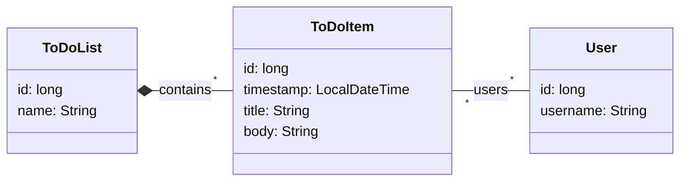
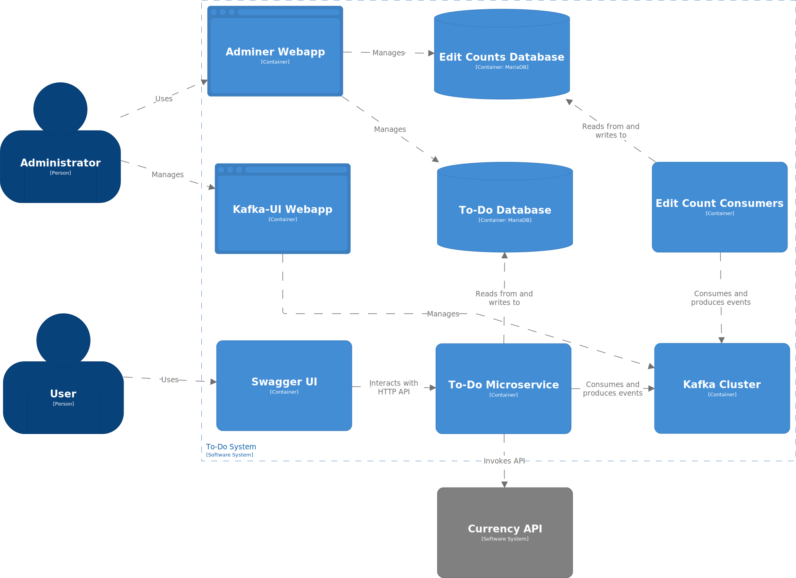

# Example Micronaut microservice

This project contains an example of a small microservice developed with [Micronaut](https://micronaut.io/).

## Bounded context: to-do lists

The microservice can keep track of one or more to-do lists with their own names.
Each list has zero or more items, with titles, bodies, and timestamps.
An item can be assigned to multiple users, and a user can be assigned to multiple items.


```mermaid
classDiagram
direction LR

class ToDoList {
  id: long
  name: String
}

class ToDoItem {
  id: long
  timestamp: LocalDateTime
  title: String
  body: String
}

class User {
  id: long
  username: String
}

ToDoList *-- "*" ToDoItem: contains
ToDoItem "*" -- "*" User: users
```

There is an additional microservice that consumes Kafka events produced by the main microservice to keep ongoing counts of edits for each list.

## C4 container model

The system can be described through the following [C4 container model](https://c4model.com/):



## Endpoints

The microservice has RESTful endpoints for both lists and items.
For a list of the endpoints, start the application by running the Gradle `run` task and visit:

http://localhost:8080/swagger-ui

The edit counts microservice can be started similarly, and its endpoints will be similarly available from:

http://localhost:8081/swagger-ui

## Integration testing with Docker Compose

To try out the microservice running on its own Docker image, run these commands from this folder:

```sh
cd todo-microservices
./gradlew dockerBuild
cd ..

cd edit-count-consumers
./gradlew dockerBuild
cd ..

./compose-it.sh up -d
```

This will build a Java-based Docker image of the microservice and a [sample application with several Kafka consumers](./edit-count-consumers), and then start it together with its dependencies and some web-based UIs to help debugging.

The microservices will be behind an [nginx](https://nginx.org/) reverse proxy, acting as a simple example of what an "API layer" would do in a microservices architecture:

- To-do microservice: http://localhost:8080/todo/swagger-ui
- Edit counts microservice: http://localhost:8080/edits/swagger-ui

The nginx reverse proxy automatically redirects requests to the Swagger UI to use the appropriate context path.

After starting the microservices, you can run end-to-end tests with the following commands:

```sh
cd e2e-tests
MICRONAUT_ENVIRONMENTS=prod ./gradlew test
```

The `docker` environment is used to change the service URLs to point to the reverse proxy.


## Viewing and editing the C4 model

The above C4 model was created using the textual [Structurizr DSL](https://docs.structurizr.com/dsl/).

The Compose file includes a container that runs the [Structurizr Lite](https://structurizr.com/help/lite) Docker image, which will automatically visualise the contents of the [`structurizr/workspace.dsl`](structurizr/workspace.dsl) file.
After running `./compose-it.sh up -d`, Structurizr Lite is available from this URL:

http://localhost:9002/

To experiment with the Structurizr DSL, edit the `workspace.dsl` with your preferred text editor, and reload the page.
